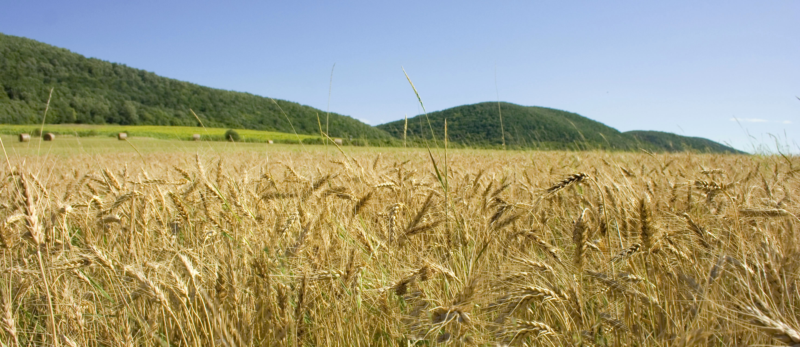

# Wheat_Object_Detector

Resnet 50 and Feature Pyramid Network implementation for wheat object detector

The dataset was provided by the Kaggle community in the following link:

https://www.kaggle.com/c/global-wheat-detection/data?select=train

In order to download the dataset just use the following Kaggle API commands:

`pip install kaggle`
`kaggle competitions download -c global-wheat-detection`

The model trained has a mAP = 0.75.

The model has the following results:

If you have any inquiry do not hesitate in contact me:

robertoariasg88@gmail.com
